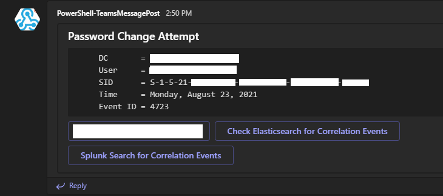
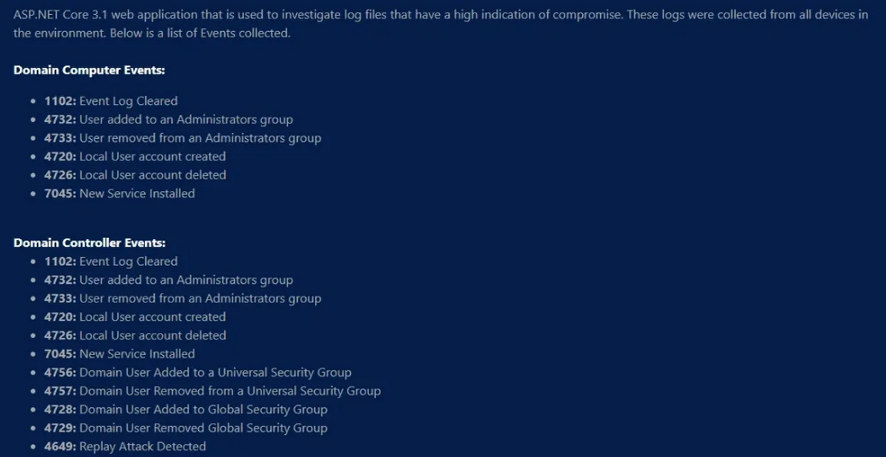
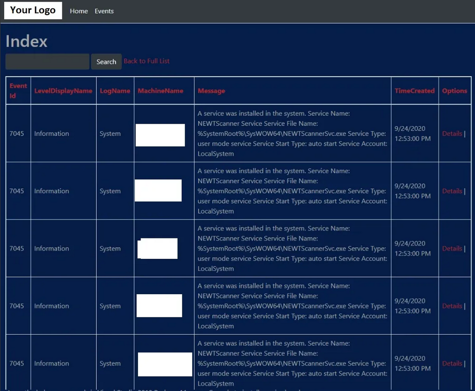
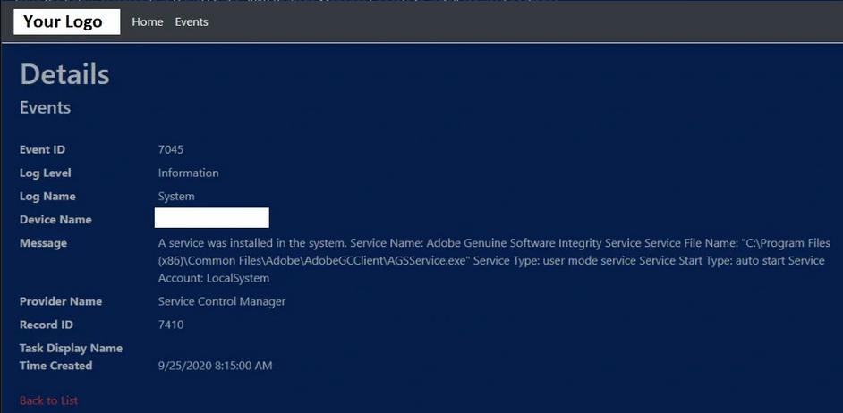

Welcome to The B.T.P.S Security Package's documentation!
========================================================
* `GitHub Page <https://github.com/OsbornePro/BTPS-SecPack>`_
* `GitLab Page <https://gitlab.com/tobor88/BTPS-SecPack>`_
* `PayPal Donations <https://www.paypal.com/cgi-bin/webscr?cmd=_donations&business=AGKU5LWZA67XC&currency_code=USD&source=url>`_
* `LiberPay Donations <https://liberapay.com/tobor/donate>`_
* `Report Issues <https://osbornepro.com/schedule-or-contact>`_

**Code Signing**

If for whatever reason you would like me to use my legitimate Code Signing Certificate to sign any of the scripts in this repository that you have modified in some way, feel free to email me your request at info@osbornepro.com and include the script in TXT file attachment. I will then sign it ASAP and send it back to you.

**Contributions**

This is open source so if you wish to help contribute to the contents of this project feel free to reach out to me at rosborne@osbornepro.com with your thoughts and ideas. For more general information on this feel free to refer to the `CONTRIBUTING <https://github.com/OsbornePro/BTPS-SecPack/blob/master/CONTRIBUTING.md>`_ documentation.

**General Summary for this project can be read at** https://github.com/OsbornePro/BTPS-SecPack/blob/master/README.md
This repo contains a collection of PowerShell tools that can be utilized to protect defend an environment based Microsoft's recommendations.
This repo also assumes that you have referenced the Windows Event Logging Cheat Sheet for logging in your environment. Use `LOG-MD <https://www.imfsecurity.com/free>`_ or `CIS-CAT <https://learn.cisecurity.org/benchmarks#:~:text=CIS%20Benchmarks%20are%20the%20only%20consensus-based%2C%20best-practice%20security,and%20accepted%20by%20government%2C%20business%2C%20industry%2C%20and%20academia>`_ to ensure the recommended logging is configured.

The `Installer.ps1 <https://github.com/OsbornePro/BTPS-SecPack/blob/master/Installer.ps1>`_ script is good to go. I created a virtual environment and ran everything from scratch to ensure you get the max protection and visibility possible with the least amount of fuss. If you experience any trouble please let me know so I am aware and can fix it. If you experience any issues or need help, feel free to reach out to me. My aim is to make this as easy to get going as possible. If something is to difficult or confusing please tell me about it. rosborne@osbornepro.com I am still adding content to this site as it is fairly new.

**FEATURES COMING SOON**

* **ELK SIEM Tool:** I am going to set up a configuration for the ELK SIEM tool. This tool is free for certain uses and offers a purchase if desired. It will include `Elasticsearch <https://www.elastic.co/elasticsearch/>`_, `Kibana <https://www.elastic.co/kibana>`_, and `Winlogbeat <https://www.elastic.co/beats/winlogbeat>`_. The configuration is going to use the Windows Event Forwarding (WEF) configuration. The purpose of this is to prevent the need to install agents on the devices in your environment. The free version does not offer LDAP authentication unfortunately. The configuration will use TLS certificates to encrypt communications on the local host and listen for outside connections if you decide to install other stack programs such as `APM-Server <https://www.elastic.co/apm>`_, `Heartbeat <https://www.elastic.co/beats/heartbeat>`_, or `Metricbeat <https://www.elastic.co/beats/metricbeat>`_. `Winlogbeat <https://www.elastic.co/beats/winlogbeat>`_ logs will be modified to include `GeoIP data <https://www.elastic.co/blog/geoip-in-the-elastic-stack>`_ tags that can be used for mapping IP addresses. Default passwords will of course also be changed. I will also create a Docker file that can be used to prevent the need for too much manual set up. When available it can be obtained from the Official OsbornePro LLC docker site: https://hub.docker.com/orgs/osbornepro
* I am **NO** longer planning on integrating the `Virus Total API <https://support.virustotal.com/hc/en-us/articles/115002100149-API>`_ for MD5 hash comparisons. This does not provide enough cost per value however, I included a script to do this in case it is valuable to your situation. The script is located here: https://github.com/OsbornePro/BTPS-SecPack/blob/master/Sysmon/HashValidator.ps1

**IMPORTANT:** This **Blue Team PowerShell Security Package**, assumes that you have referenced the `Windows Event Logging Cheat Sheet <https://www.malwarearchaeology.com/cheat-sheets/>`_ for logging in your environment. Use `LOG-MD <https://www.imfsecurity.com/free>`_ or `CIS-CAT <https://www.cisecurity.org/cis-benchmarks/>`_ (*an SCAP Tool*) to ensure the recommended logging is configured. These logging recommendations adhere to commonly accepted guidelines in the cyber security community. Even without the use of this security application, these guidelines should be followed to better assist your organization in the event of a compromise.

**CODE CONTRIBUTIONS**
I am always open to suggestions and ideas as well as contributions if  anyone wishes to help add to this package. Credit will of course be given where credit is due. If you wish to contribute I have placed some info on that `HERE <https://github.com/tobor88/BTPS-SecPack/blob/master/CONTRIBUTING.md>`_.

**What Purpose Does This Serve?**

This repository contains a collection of PowerShell tools that can be utilized to protect and defend an environment based on the recommendations of multiple cyber security researchers at Microsoft. These tools were created with a small to medium size mostly Windows environment in mind as smaller organizations do not always have the type of funding available to overly spend on security. The goal of this project lines up with the goals of `OsbornePro LLC. <https://osbornepro.com/>`_ This exists to help add value to a smaller organization's security by creating more visibility for the IT Administrator or Security Team.

**IMPORTANT NOTE FOR LARGE ENVIRONMENTS**

For the case of organizations with 1,000’s of devices; you may find that this entire suite does not apply to you. This has to do with how some of the discoveries operate. For example the alert I have in the `Device Discovery <https://github.com/OsbornePro/BTPS-SecPack/tree/master/Device%20Discovery>`_ directory relies on DHCP assigned IP addresses. All DHCP servers in an environment are queried to create a list of known MAC addresses. This information is then saved to a CSV file for reference in discovering any new devices that join a network. This file could become too large to be effective. The other alert I can see not being effective is the `"Local Port Scan Alert" <https://github.com/tobor88/BTPS-SecPack/blob/master/Local%20Port%20Scan%20Monitor/Watch-PortScan.ps1>`_. This is because if there is an over abundance of connections the script will not be able to cover all of the connections quickly enough. Other alerts in this security package are still appropriate no matter the network size as they are Event ID based typically. To begin, I suggest setting up WinRM over HTTPS in your environment.

Functionality in The Blue Team PowerShell Security Package
----------------------------------------------------------

**Account Lockout Notification**
This alert lets you know when a user account has been locked out. There is also an alert to be notified when a locked out account has been manually unlocked.

.. image:: img/AccountLockout.png
   :scale: 100
   :alt: Account Lockout

**Attempted Port Scan**
This alert informs the cyber security team when a port scan has been attempted against a server. This currently does not work for File Servers or VoIP servers which have hundreds of unique IP addresses connecting a minute.

.. image:: img/AttemptedPortScan.png
    :scale: 100
    :alt: Attempted Port Scan

**AutoRuns Logging**
This is showing the Autoruns Event Viewer entry that gets created. An easy to read CSV file also gets saved to ``C:\\Program Files\\AutorunsToWinEventLog\\AutorunsOutput.csv`` Thanks to:  `https://github.com/palantir/windows-event-forwarding/tree/master/AutorunsToWinEventLog <https://github.com/palantir/windows-event-forwarding/tree/master/AutorunsToWinEventLog>`_

.. image:: img/AutoRuns.png
    :scale: 100
    :alt: AutoRuns

**Blacklisted IP Logging**
When a device establishes a connection to an IP that is on 4 or more blacklists or a domain that is less than 2 years old you will be informed. The events are also stored in the Event Viewer under **"MaliciousIPs"**. It seems that an IP address on 3 blacklists does not necessarily mean it is dangerous or something to do anything about. Correct me if my analysis is wrong.

.. image:: img/BlacklistedIP.png
    :scale: 100
    :alt: Blacklisted IP Logging

**Check Forwarding Rules**
This alert is meant to come in once a week. It allows administrators to easily view any email forwarding rules and ensure that no information is being compromised unknowingly.

.. image:: img/CheckForwardingRules.png
    :scale: 100
    :alt: Check Forwarding Rules

**Track Network Connection History**
`ListenPortMonitor.ps1's <https://github.com/OsbornePro/BTPS-SecPack/blob/master/Local%20Port%20Scan%20Monitor/ListenPortMonitor.ps1>`_ main goal is to keep an eye open for newly opened ports on a server to discover possible Reverse Shells or Bind Shells. A connection history log is kept to help trace connections that have been established with a server.

.. image:: img/ConnectionHistory.png
    :scale: 100
    :alt: Track Network Connection History

**Disable Weak SSL Ciphers**
Hardening cmdlet allows you to quickly and easily disable weak TLS protocols and associated ciphers to prevent weak encryption methods from being used.

.. image:: img/DisableWeakCiphers.png
    :scale: 100
    :alt: Disable Weak SSL Ciphers

**DNS Zone Transfer Alerts**
This alert was triggered by an executed DNS Zone transfer. Normal DNS server communication does not trigger this alert. Manually requesting a zone transfer will, allowing you to discover any attackers looking to learn about your environment.

.. image:: img/DNSZoneTransfer.png
    :scale: 100
    :alt: DNS Zone Transfer Alerts

**Enable DNS over HTTPS**
This hardening cmdlet allows you to easily enable or if desired disable DNS over HTTPS on any Windows 10+ Device in your environment

.. image:: img/EnabledDNSoverHTTPS.png
    :scale: 100
    :alt: Enable DNS over HTTPS

**Insecure LDAP Bind Notifications**
This alert is to let you know when an LDAP Bind occurs that is not encrypted with LDAP over SSL. This can help to implement LDAP over SSL in an environment or discover possible LDAP enumeration attempts from an attacker.

.. image:: img/InsecureLdapBinds.png
    :scale: 100
    :alt: Insecure LDAP Bind Notifications

**New Device Joined Network Discovery**
This alert is displaying 4 devices that recently were physically plugged into an Ethernet cable or joined the Wi-Fi network. Now that these devices are known they will not be detected again unless you remove them from the CSV file containing device history info.

.. image:: img/NewDeviceCheck.png
    :scale: 100
    :alt: New Device Check Discovery

**User Changed Password Notification**
Receive an alert whenever a user has changed their password. Compare this value to the Administrator list you receive. This allow you to notice any passwords changing outside normal conditions.

.. image:: img/NormalPasswordChange.png
    :scale: 100
    :alt: User Changed Password Notification

**Admin Changed Another Users Password Notification**
This alert informs you when a users password has been changed by an Administrator or other user. Allowing user to change passwords through Azure will generate this alert as well.

.. image:: img/PasswordChanged.png
    :scale: 100
    :alt: Admin changed another users password notification

**List of Expiring Passwords Notification**
Receive a list of users whose passwords are expiring in the next 2 weeks. This helps you keep tabs and who is expected to be changing their passwords. Someone not on this list who has their password changed may be under attack.

.. image:: img/PasswordsExpiring.png
    :scale: 100
    :alt: List of Expiring Passwords Notification

**Local Port Scan Notification**
This alert informs the cyber security team when a port scan has been attempted against a server. This currently does not work for File Servers or VoIP servers which have hundreds of unique IP addresses connecting a minute.

.. image:: img/PortScanDetection.png
    :scale: 100
    :alt: Local Port Scan Notification

**Remediate a compromised Office365 account**
This is some output showing the results of what happens when the `RemediateCompromisedOfficeAccount.ps1 <https://github.com/OsbornePro/BTPS-SecPack/blob/master/Incident%20Response/RemediateCompromisedOfficeAccount.ps1>`_ is run. For more information on what this does click `HERE <https://github.com/OsbornePro/BTPS-SecPack/blob/master/RemediateCompromisedOfficeAccount.ps1>`_.

.. image:: img/RemediateCompromisedOfficeAccount.png
    :scale: 100
    :alt: Remediate a compromised Office365 account

**Suspicious Event Occurred**
This alert was triggered from centralized logs using Windows Event Forwarding. System Update, when run on Lenovo computers as a standard user, will create a temp account, add it to the local administrators group and install missing updates. It then removes the created account from the local Administrators group and deletes the account. If this were an attacker trying to cover their tracks this would have caught it.

.. image:: img/SuspiciousEventTriggered.png
    :scale: 100
    :alt: Suspicious Event Occurred

**Unusual Sign In Alert**
This alert is letting the recipient know the reception account signed into a device outside of its normal assignments

.. image:: img/UnusualSignIn.png
    :scale: 100
    :alt: Unusual Sign In Alert

**User Account Expiring Notification**
This alert lets IT Administrators know when a user account is about to expire.

.. image:: img/UserAccountExpiring.png
    :scale: 100
    :alt: User Account Expiring Notification

**User Account Unlocked**
This alert informs administrators when a user account has been manually unlocked as well as who unlocked what account.

.. image:: img/UserAccountUnlocked.png
    :scale: 100
    :alt: User Account Unlocked

Using the "microsoft-teams" branch repository
=============================================
If you wish to use Microsoft Teams for sending alerts instead of using email you will want to load the `microsoft-teams <https://github.com/OsbornePro/BTPS-SecPack/tree/microsoft-teams>`_ branch for this repository which has the Teams alert modifications. It will take me a little while to implement this as a configuration option in the install script. Using Microsoft Teams for alert posts does not remove the need for certain email notifications in this repository. Email will still be used for some of the actions. These Teams Posts are able to be completed after you first create a webhook. So-called webhooks offer the possibility to send alerts or other notifications to a Microsoft Teams channel.

* `Microsoft Documentation to Create a Webhook <https://docs.microsoft.com/en-us/microsoftteams/platform/webhooks-and-connectors/how-to/add-incoming-webhook>`_
* `Microsoft Documentation on Using Webhooks <https://docs.microsoft.com/en-us/microsoftteams/platform/webhooks-and-connectors/how-to/connectors-using?tabs=cURL>`_

You can create a webhook using the following steps (if you are an admin)

#. Open the Microsoft Teams application
#. In the left hand pane click **Teams**
#. Click the more options icon represented by 3 dots **...** next to one of the desired Teams Channels. Example Channel Name: General
#. Clicking those 3 dots will display a dropdown menu. Click **Connectors**
#. Click the **Add** button next to **Incoming Webhook**
#. Click **Add** on the Incoming Webhook pop up screen
#. On the Incoming Webhook screen perform the following actions 
    #. Define a name for your webhook. In the below image this value is *PowerShell-TeamsMessagePost*
    #. Click **Create**
    #. Optionally you can also use **Upload Image** to select an image for the Incoming Webhook. In the below image I left the default icon which is the light blue triangle on white background. 
    #. Click **Create**
#. The Incoming Webhook URL is created. Copy the URL and click **Done**

You can now use the above URL in the B.T.P.S Security Package scripts I provide. You can quickly update the value in the scripts by executing the below commands

.. code-block::
    
    $WebHook = Read-Host -Prompt "Paster your Webhook URL here: "
    $SIEM = Read-Host -Prompt "If you have a SIEM in your environment enter the link here: "
    $BTPSHome = Read-Host -Prompt "Where did you save the BTPS Security Pacakge git repo? EXAMPLE: C:\Users\Administrator\Downloads\BTPS-SecPack-microsoft-teams"
    $Files = (Get-ChildItem -Path $BTPSHome -Include "AttemptedPasswordChange.ps1","AttemptedPasswordReset.ps1","Failed.Username.and.Password.ps1","User.Account.Created.ps1 ","User.Account.Locked.ps1","User.Account.Unlocked.ps1","DNSZoneTransferAlert.ps1","NewComputerAlert.ps1","Query-InsecureLDAPBinds.ps1","UnusualUserSignInAlert.ps1","Watch-PortScan.ps1 " -Recurse -ErrorAction SilentlyContinue -Force).FullName
    ForEach ($File in $Files) {
        ((Get-Content -Path $File -Raw) -Replace "WEBHOOK_URL_REPLACE","$WebHook") | Set-Content -Path $File -Force
        ((Get-Content -Path $File -Raw) -Replace "SIEM TOOL LINK","$SIEM") | Set-Content -Path $File -Force
    }  # End ForEach

Using the Installer.ps1 File to Get Started
===========================================
I wrote the `Installer.ps1 <https://github.com/OsbornePro/BTPS-SecPack/blob/master/Installer.ps1>`_ script allow anyone to quickly and easily install as many protections as possible offered by the B.T.P.S. Security Package. Running this script requires very minimal to zero know how. You do not need to know how to download the Git repository. `Installer.ps1 <https://github.com/OsbornePro/BTPS-SecPack/blob/master/Installer.ps1>`_ will do it for you :-)

**How can I get started using the Installer.ps1 install file?**
Here is what you need to do in order to execute this file.

1. Log into your Primary Domain Controller using an account with Administrator permissions.
2. Open an Administrative PowerShell session **(Windows Key + X, The press A)**.
3. Execute the command in step 4. This can be done by highlighting the command. Right click the highlighted text and select "COPY". Then Right Click inside your PowerShell window. If this does not paste right away you can paste by doing the key combo **(Ctrl + V)**. This command executes all the text on that webpage inside of your powershell session without downloading the file to your disk drive.
4. ``IEX (New-Object -TypeName System.Net.WebClient).downloadString('https://raw.githubusercontent.com/OsbornePro/BTPS-SecPack/master/Installer.ps1')``
5. The installation of the B.T.P.S Security Package should then start. Some Next Generation Anti-Virus providers may block script execution in this manner. If that is the case use the below method to accomplish the same task.

**IF ABOVE COMMAND METHOD DOES NOT WORK**

Some Endpoint Detection and Response (EDR) and Next Generation Anti-Virus providers may block script execution in this manner. If that is the case use the below method to accomplish the same task.

1. Log into your Primary Domain Controller using an account with Administrator permissions.
2. Open an Administrative PowerShell session **(Windows Key + X, The press A)**.
3. The command displayed in step 4 will download the script to your disk in your Downloads directory. Copy and paste the command into your admin powershell session and press **ENTER** to execute it.
4. ``Invoke-WebRequest -Uri "https://raw.githubusercontent.com/OsbornePro/BTPS-SecPack/master/Installer.ps1" -OutFile "$env:USERPROFILE\Downloads\Installer.ps1"``
5. Execute the command line in step 6 to ensure your Execution Policy allows the script to execute easily. Copy and paste the command into your admin powershell session and press **ENTER** to execute it.
6. ``Set-ExecutionPolicy RemoteSigned -Force``
7. Execute the command line in step 8 to run the script and being installation. Include the period at the beginning of the command. Copy and paste the command into your admin powershell session and press **ENTER** to execute it.
8. ``."$env:USERPROFILE\Downlods\Installer.ps1"``
9. The installation of the B.T.P.S. Security Package should then begin.

**OTHER DOWNLOAD FILE COMMANDS**

As an FYI there are multiple ways to download files from the PowerShell session. If ``Invoke-WebRequest`` is blocked or does not work for you, one of the below commands may be able to work instead. Each command does the same thing in a different way and each command is one line.

* ``(New-Object Net.WebClient).DownloadFile('https://raw.githubusercontent.com/OsbornePro/BTPS-SecPack/master/Installer.ps1', "$env:USERPROFILE\Downloads\Installer.ps1")``

* ``Start-BitsTransfer "https://raw.githubusercontent.com/OsbornePro/BTPS-SecPack/master/Installer.ps1" -Destinations "$env:USERPROFILE\Downloads\Installer.ps1"``

* ``certutil.exe -urlcache -split -f https://raw.githubusercontent.com/OsbornePro/BTPS-SecPack/master/Installer.ps1 "$env:USERPROFILE\Downloads\Installer.ps1"``

* ``bitsadmin /transfer debjob /download /priority normal https://raw.githubusercontent.com/OsbornePro/BTPS-SecPack/master/Installer.ps1" "$env:USERPROFILE\Downloads\Installer.ps1"``

Download PDF Instructions for Installer.ps1
-------------------------------------------
Below link contains images and walks you through the Installer.ps1 setup steps and process. I recommend checking this out if you are executing the installer script to make sure there are no misunderstandings during it's execution.

https://github.com/OsbornePro/Documents/raw/main/Installer.ps1%20Demo.pdf

Configure WinRM over HTTPS
==========================
I posted a YouTube video covering the settings configured for WinRM over HTTPS communication through the use of Group Policy. These settings can be seen in the sections below.

`YouTube Video : Configure WinRM over HTTPS Instructions <https://youtu.be/UcU2Iu9AXpM>`_

Useful WinRM Info and Commands To Know
--------------------------------------
Setup WinRM over HTTPS may require the need to know a few commands. I have included these commands below.

``Enable-PSRemoting -Force # Enables firewall rules for WinRM``
``winrm qc -q # Qucik config for WinRM 5985``
``winrm enum winrm/config/listener # Enumerate cert thumbprint used on different winrm ports``
``winrm delete winrm/config/listener?Address=*+Transport=HTTPS # Delete winrm certificate and stop listener on 5986. This allows new cert to be attached to port``
``winrm create winrm/config/listener?Address=*+Transport=HTTPS # Creates a WinRM listener on 5986 using any available certificate``

The below command defines a certificate to use on port 5986. Certificate Template needed is a Web Server certificate from Windows PKI
``New-WSManInstance -ResourceUri WinRM/Config/Listener -SelectorSet @{Address = "*"; Transport = "HTTPS"} -ValueSet @{Hostname = FqdnRequiredHere.domain.com; CertificateThumbprint = $Thumbprint }``

**SERVER CERTIFICATE INFO:**

The certificate thumbprint value that you are going to need in **"Group Policy Setting 1"** below is from your internal domains Private Key Infrastructure (PKI). This value will vary as these values are unique to the certificate. The Root Certificate Authority (CA) assigns certificates to your devices. When a device receives a certificate, it gets assigned under the Root CA's certificate. This creates what is called a Certificate Chain. If it helps to see this represented in a directory tree format, it would look something like the below tree structure. Your domain would not have an Intermediate CA most likely but I included it for the visual.

* Root CA Certificate <-- *This is the certificate thumbprint you need*
    * Intermediate CA Certificate
        * Assigned Device Certificate
        * Assigned Device Certificate <-- *This certificate's thumbprint gets assigned to port 5986 on the client device*

**CLIENT CERTIFICATE INFO:**

* In the above tree, **"Assigned Device Certificate"** is where the below command would be used
``New-WSManInstance -ResourceUri WinRM/Config/Listener -SelectorSet @{Address = "*"; Transport = "HTTPS"} -ValueSet @{Hostname = FqdnRequiredHere.domain.com; CertificateThumbprint = $Thumbprint }``

* Notice the **"Hostname"** value includes the domain you are in. This needs to also be true for the **"Common Name"** value when the client device requests the WinRM certificate. This means your CN value is required to be devicename.domainname.com. If you do not include the domain name in the Common Name value your WinRM over HTTPS communication will not work. Subject Alternative Name's (SAN) will not work either. I have tried adding more than one Common Name values to a certificate and this communication still failed.

* If you are using a Windows Server Certificate Authority, the **"WebServer"** certificate template can be used to request the certificate needed.

Group Policy Windows Event Forwarding (WEF) Settings
----------------------------------------------------

**GROUP POLICY SETTING 1**

The Group Policy setting **"Computer Configuration > Policies > Administrative Templates > Windows Components > Event Forwarding > Configure Target Subscription Manager"** needs to be set to **WinRM over HTTPS (Port 5986)**: In my environment I added 2 entries for this to cover all basis. One has the CA certificate thumbprint with with spaces after every 2 numbers, and the other entry is without spaces. The example values are below.

1. **Example Entry 1**

``Server=https://wef.domain.com:5986/wsman/SubscriptionManager/WEC,Refresh=900,IssuerCA=ff ff ff ff ff ff ff ff ff ff ff ff ff ff ff ff ff ff ff ff``

2. **Example Entry 2**

``Server=https://wef.domain.com:5986/wsman/SubscriptionManager/WEC,Refresh=900,IssuerCA=ffffffffffffffffffffffffffffffffffffffff``
**NOTE:** The default Refresh rate value is 900 seconds or 15 minutes. This does not need to be defined. I included it to be thorough.

3. **Kerberos Example Entry 3**

Using the below value without a certificate defined will allow/use Kerberos for authentication which is fine to use
``Server=https://wef.domain.com:5986/wsman/SubscriptionManager/WEC,Refresh=900``

**GROUP POLICY SETTING 2**

The Group Policy Setting **"Computer Configuration > Policies > Administrative Templates > Windows Components > Event Log Service > Security > Change Log Access"** needs to be set to the value of the property **"ChannelAccess"** after issuing the below command:

``wevtutil gl security``

Group Policy Setting **"Computer Configuration > Policies > Administrative Templates > Windows Components > Event Log Service > Security > Change Log Access (Legacy)"** needs to be set to the value of the property **"ChannelAccess"** after issuing the below command:

``wevtutil gl security``

Group Policy WinRM Settings
---------------------------

**GROUP POLICY SETTING 3**

In your group policy settings go to **"Computer Configuration > Preferences > Control Panel Settings > Services"**.

Then right click and add a New Service.

Set the **"Startup Type"** to **"Automatic"**.

Set the "Service Name" to **WinRM**, set the **"Service Action"** to **"Start Service"**, set the **"Wait Timeout"** to **30** seconds.

In the recovery tab select **"Restart the Service"** from the three failure options.

Set **"Reset Fail Count after"** to **0** days and **"Reset Service after"** to **1** minutes.

Then click **OK** to save.

**GROUP POLICY SETTING 4**

Next, still on the same policy object, is the list of IP addresses that are allowed to do remote management access  on the target computer.

Go to **Computer Configuration > Policies > Administrative Templates > Windows Components > Windows Remote Management (WinRM) > WinRM Services**.

Then double click on **"Allow remote server management through WinRM"**" to modify the setting as follows:

Set the policy to **"Enabled"**

Set the **IPv4 Filter** to * or an all encompassing subnet for your environment such as ``10.0.0.0/16``

Leave the **IPv6 Filter** blank or set it to a wildcard ``*`` as well.

Click **OK** to save.

**GROUP POLICY SETTING 5**

Edit the settings — Opening Firewall ports

Next we will create a new rule for the Firewall on the targeted client PC's.

Go to **Computer Configurations > Policies > Security Settings > Windows  Firewall and Advanced Security > Windows Firewall and Advanced  Security**

Then right click on **Inbound Rules** > **New Rule**

Create a new rule called ``Allow WinRM over HTTPS``

We want to allow the inbound connection on port **5986**

Leave the Tick mark on **"Domain"** and **"Private"**

We then want to create a few more firewall rules using the default firewall rules

* Remote Event Log Management (RPC-EPMAP)
* Remote Event Monitor (RPC-EPMAP)
* Remote Event Log Management (RPC)
* Remote Event Monitor (RPC)
* Remote Service Management (RPC-EPMAP)
* Remote Service Management (RPC)
* Remote Scheduled Tasks Management (RPC-EPMAP)
* Remote Scheduled Tasks Management (RPC)

This should be enabled to **Allow inbound traffic** in the **"Domain"**, and **"Private"** profiles

For good measure if you like you can deny traffic on port 5985.

This is done by adding firewall default firewall rule **"Windows Remote Management (HTTP-In)"**, and Blocking traffic to that port.

**GROUP POLICY SETTING 6**

Under **Administrative Templates > Network > Network Connections > Windows Defender Firewall > Domain Profile**

Set the policies for

* Windows Defender Firewall: Allow ICMP exceptions
* Windows Defender Firewall: Allow inbound remote administration exception
* Windows Defender Firewall: Allow inbound Remote Desktop

Set to **"Enabled"**

Define the filter you used in **Group Policy Setting 4** for these allowed values.

For example you may have used a Wildcard ``*`` or defined an all encompassing subnet range such as ``10.0.0.0/16``

**GROUP POLICY SETTING 7**

Under **Administrative Templates > System > Credentials Delegation > Allow delegating fresh credentials** and set the values to ``WSMAN/*.yourdomain.com``.

This will allow WinRM communication between any host ending in yourdomain.com.

Then set **"Allow delegating fresh credentials with NTLM-only server authentication"** under that same tree to that value ``WSMAN/*.yourdomain.com``.

For example my email rosborne@osbornepro.com is in the domain osbornepro.com.

I would set the value to ``WSMAN/*.osbornepro.com``.

We also want to Enable **"Encryption Oracle Remediation"** and set the drop down value to **"Force Updated Clients"**.

This is to prevent `CVE-2018-0886 <https://nvd.nist.gov/vuln/detail/CVE-2018-0886>`_ exploitation.

**GROUP POLICY SETTING 8**

Under **Administrative Templates > Windows Components/Windows Remote Management (WinRM)/WinRM Client** set the below settings.

* **Allow Basic authentication:** ``Enabled``
* **Allow CredSSP authentication:** ``Enabled``
* **IPv4 filter:** ``*``
* **Allow remote server management through WinRM:** ``Enabled``
* **IPv6 filter:** ``*``
* **Allow unencrypted traffic:** ``Disabled``
* **Disallow WinRM from storing RunAs credentials:** ``Enabled``
* **Disallow Kerberos authentication:** ``Disabled`` : **IMPORTANT:** If you are using `CIS-CAT Pro Dashboard (CCPD) <https://www.cisecurity.org/cybersecurity-tools/cis-cat-pro/>`_ or are using Kerberos authentication with Windows Event Forwarding **ENABLE** this instead)

**GROUP POLICY SETTING 9**

Under **Administrative Templates > Windows Components/Windows Remote Management (WinRM)/WinRM Service** set the below settings

* **Allow Basic authentication:** ``Enabled``
* **Allow remote server management through WinRM:** ``Enabled``
* **Allow CredSSP authentication:** ``Enabled``
* **IPv4 filter:** ``*``
* **IPv6 filter:** ``*``
* **Allow unencrypted traffic:** ``Disabled``
* **Disallow Kerberos authentication:** ``Disabled``
* **Disallow WinRM from storing RunAs credentials:** ``Enabled``
* **Turn On Compatibility HTTP Listener:** ``Disabled``
* **Turn On Compatibility HTTPS Listener:** ``Enabled``

**GROUP POLICY SETTING 10**
Create a Registry Setting that gets pushed out through Group Policy containing the below value

**SETTING:**

|    Path: ``HKLM:\Software\Policies\Microsoft\Windows NT\CurrentVersion\NetworkList\Signatures\010103000F0000F0010000000F0000F0C967A3643C3AD745950DA7859209176EF5B87C875FA20DF21951640E807D7C24\Category``
|    Name: ``State``
|    Value: ``1``

**CONCLUSION**
WinRM over HTTPS is now configured for your environment. Great work! When you now use PowerShell commands such as ``Invoke-Command`` or ``New-PSSession`` you will need to specify the ``-UseSSL`` parameter in order to use WinRM over HTTPS. Port 5985 will not accept connections in an ideal setup.

Windows Event Forwarding (WEF) Application
==========================================

**Summary**

The purpose of this web application is to easily investigate any email alerts received that indicate a possible compromise. This server has Windows Event Forwarding (WEF), configured in a "source collector" set up. This means that the clients in the environment initiate connections to the server before sending logs. When one of the suspicious event ID's occur on any of the devices, the event info is forwarded to the WEF source collector server using WinRM over HTTPS. Once an hour the collected event logs are imported into a SQL database. Any newly discovered events that indicate possible compromise trigger an email alert which is then sent to the IT Administrators. This application can be used to search that SQL database and view the details of an event. The SQL database is useful because searching a SQL database is 100x faster than parsing the Windows Event Logs through XML. It also stores critical events for a longer period of time than the events would normally exists inside Event Viewer. This is because when Event Viewer logs reach a certain size, old logs are removed to make room for new ones.

Protection against SQL injections and CSRF have been implemented. Penetration testing has been performed to ensure the security of the application. There are no presently discovered vulnerabilities. Security is a feature! If you find a vulnerability that I have not please let me know so I can fix it. rosborne@osbornepro.com

**Functionality**

* **REORDER:** The columns in the database table can be organized by ascending or descending order. This is done by clicking the linked column header.
* **SEARCH:** The search will parse the database by searching for the specified term in all of the columns. There are presently 10 items that will be displayed per page.
* **DETAILED:** Events can also be shown in a detailed view by clicking the "Details" button next to an event in the table. This will display a few more bits of info for the event.

**Table View of WEF Application**

This WEF Application is used to view and list log files that are a high likelihood to be indications of compromise. These logs get collected from all devices in the environment. The following Event ID's are collected and put into the database: 1, 2, 1102, 4732, 4733, 4720, 4726, 7045, 4756, 4757, 4728, 4729, 4649, and 4723

+------------+------------------------------------------------------------+
| Event ID   | Description                                                |
+============+============================================================+
| 1          | Blacklisted IP Connected too                               |
+------------+------------------------------------------------------------+
| 2          | Connection to domain less that 2 years old                 |
+------------+------------------------------------------------------------+
| 1102       | Event log cleared                                          |
+------------+------------------------------------------------------------+
| 4732       | User added to a security enabled local group               |
+------------+------------------------------------------------------------+
| 4733       | User removed to a security enabled local group             |
+------------+------------------------------------------------------------+
| 4720       | User account was created                                   |
+------------+------------------------------------------------------------+
| 4726       | User account was deleted                                   |
+------------+------------------------------------------------------------+
| 7045       | A new service was installed                                |
+------------+------------------------------------------------------------+
| 4756       | A user was added to a security enabled universal group     |
+------------+------------------------------------------------------------+
| 4757       | A user was removed from a security enabled universal group |
+------------+------------------------------------------------------------+
| 4728       | A member was added to a security-enabled global group      |
+------------+------------------------------------------------------------+
| 4729       | A member was removed from a security-enabled global group  |
+------------+------------------------------------------------------------+
| 4649       | A replay attack was detected                               |
+------------+------------------------------------------------------------+
| 4723       | An attempt was made to change an accounts password         |
+------------+------------------------------------------------------------+

Below is an example of what the table view of an event looks like

**Detail View in WEF Application**

Events can also be shown in a detailed view by clicking the **"Details"** button next to an event in the table. This will display a few more bits of info for the event.

Perquisites and Setup Instructions
----------------------------------

This `REPO <https://github.com/OsbornePro/BTPS-SecPack/tree/master/WEF%20Application>`_ contains all the files needed for using Windows Event Forwarding to monitor an environment for intruders. This assumes that you have referenced the Windows Event Logging Cheat Sheet for logging in your environment. Use `LOG-MD <https://www.imfsecurity.com/free>`_ or `CIS-CAT <https://learn.cisecurity.org/benchmarks#:~:text=CIS%20Benchmarks%20are%20the%20only%20consensus-based%2C%20best-practice%20security,and%20accepted%20by%20government%2C%20business%2C%20industry%2C%20and%20academia>`_ to ensure the recommended logging is configured. You will also need to configure WinRM in your environment. This can be done by following the instructions at the WinRM over HTTPS page on this site.

**CONFIGURE** (This should be configured in your environment)

1. WinRM over HTTPS

**DOWNLOAD & INSTALL** (I suggest installing these on the centralized WEF collection server to get started)

1. `SSMS (SQL Server Management Studio) <https://docs.microsoft.com/en-us/sql/ssms/download-sql-server-management-studio-ssms?view=sql-server-ver15>`_

2. `Microsoft SQL Server (Express a.k.a Free Version Will Work) <https://www.microsoft.com/en-us/sql-server/sql-server-downloads>`_

3. `ASP.NET 3.1 Core Runtime <https://dotnet.microsoft.com/download/dotnet-core/3.1>`_

4. `ASP.NET 3.1 SDK <https://dotnet.microsoft.com/download/dotnet-core/3.1>`_

5. `Visual Studio <https://visualstudio.microsoft.com/vs/>`_

**SIDE NOTE 1:** It is considered best practice to have the SQL server installed on a separate device than the one hosting the application. I did not abide by this here. As long as there are not any SQL Injections and least privilege permissions are applied to accounts that can access the SQL database, this should not be a concern.

**SIDE NOTE 2:** It is also best practice to have a development server that pushes out web application builds to the production server. I do not know what resources or extras may be available to a company. As such I am treating this to be as bare minimum as possible. These are subjects that can be learned in other areas of the web. I am just showing you how to set up this security package and need to draw the line somewhere. Feel free to use my instructions and then uninstall Visual Studio from the server when you are done with setup.

File List Overview
------------------

* `DomainComputers.xml <https://github.com/OsbornePro/BTPS-SecPack/blob/master/WEF%20Application/DomainComputers.xml>`_ Windows Event Forwarding Config file for Domain Computers. can be applied on the source collector using the command: wecutil cs DomainComputers.xml
* `DomainControllers.xml <https://github.com/OsbornePro/BTPS-SecPack/blob/master/WEF%20Application/DomainControllers.xml>`_ Windows Event Forwarding Config file for Domain Controllers can be applied on the source collector using the command: wecutil cs DomainControllers.xml
* `Import-EventsHourly.ps1 <https://github.com/OsbornePro/BTPS-SecPack/blob/master/WEF%20Application/Import-EventsHourly.ps1>`_ PowerShell script that imports collected WEF events into SQL database
* `Query to Create MSSQL DB Table <https://github.com/OsbornePro/BTPS-SecPack/blob/master/WEF%20Application/Query%20to%20Create%20MSSQL%20DB%20Table>`_ Creates the required database and table configuration for the MSSQL server database. Open the SSMS application, start a New Query, and execute the contents of this file inside the query. This will build the SQL database used by the WEF Application.
* `ImportTheScheduledTasks.ps1 <https://github.com/OsbornePro/BTPS-SecPack/blob/master/WEF%20Application/ImportTheScheduledTasks.ps1>`_ This is an optional script that can be used to import XML files to the task scheduler, effectively creating the required scheduled tasks on the centralized WEF server
* `SQL-Query-Suspicious-Events.ps1 <https://github.com/OsbornePro/BTPS-SecPack/blob/master/WEF%20Application/SQL-Query-Suspicous-Events.ps1>`_ PowerShell script that discovers possible indicators of compromise and sends and an email alert.
* `TaskForSQLQueryEventsMonitor.xml <https://github.com/OsbornePro/BTPS-SecPack/blob/master/WEF%20Application/TaskForSQLQueryEventsMonitor.xml>`_ Task Scheduler import file that goes with SQL-Query-Suspicious-Events.ps1. This executes on SQL-Query-Suspicious-Events.ps1 on the hour. If any new events are viewed as possible indications of compromise an alert email will be sent out.
* `TaskImportFile.xml <https://github.com/OsbornePro/BTPS-SecPack/blob/master/WEF%20Application/TaskImportFile.xml>`_ Task Scheduler Import file that goes with Import-EventsHourly.ps1. This task will execute the Import-EventsHourly.ps1 script once an hour on the half hour, importing the most recent events into the SQL database.
* `WEFStartupScript.ps1 <https://github.com/OsbornePro/BTPS-SecPack/blob/master/WEF%20Application/WEFStartupScript.ps1>`_ This should be the startup script on all devices sending events to the source WEF collector. This ensures that the WinRM service has the correct permissions, the service is running, and the service is available to send info to the source event collector.

Setup the WEF Application
-------------------------

**Intro**

Now that WinRM over HTTPS is configured and the Group Policy Settings have been applied using instructions from the previous page we can being setting up the configuration of the source collector. If you have not done this yet that is not a big deal as it should not matter what order these tasks are carried out.

**Step 1**

In order to use the `DomainComputers.xml <https://github.com/OsbornePro/BTPS-SecPack/blob/master/WEF%20Application/DomainComputers.xml>`_ and `DomainControllers.xml <https://github.com/OsbornePro/BTPS-SecPack/blob/master/WEF%20Application/DomainControllers.xml>`_ config files in Windows Event Forwarding the below commands must be issued in an Administrator Command Prompt. Place the files DomainComputers.xml and DomainControllers.xml in the directory C:\Users\Public\Documents. Then open a Command Prompt or PowerShell window as an Administrator. This can be done with the key combo Windows Key + X, A

``wecutil cs C:\Users\Public\Documents\DomainComputers.xml``
``wecutil cs C:\Users\Public\Documents\DomainControllers.xml``

**Step 2**

Create the SQL database schema and table.

1. Open **SSMS** (SQL Server Management Studio)

2. Sign in using an Administrator account to the default selected instance

3. Click **"Execute New Query"** in the top ribbon. This will open a text window

4. Copy and paste the contents of `Query to Create MSSQL DB Table <https://github.com/OsbornePro/BTPS-SecPack/blob/master/WEF%20Application/Query%20to%20Create%20MSSQL%20DB%20Table>`_ into the query and click "Execute". This builds your SQL Database table where events will be imported.

**(Step 3 and Step 4)**

The below two steps can be accomplished by executing the `ImportTheScheduledTasks.ps1 <https://github.com/OsbornePro/BTPS-SecPack/blob/master/WEF%20Application/ImportTheScheduledTasks.ps1>`_. I have this automatically search for the XML files that need to be imported into Task Scheduler. Long as you do not rename the files in this repository this should go off without a hitch.

**USER YOU SELECT:** The above script will prompt you for a username to use in the Task Schedulers execution of alerting and import files. The user you define will need to have been configured to have **"Log on as batch job"** permissions and **"Log on as service"** permissions. This is done through Group Policy at **"Computer Configuration > Windows Settings > Security Settings > User Rights Assignment"** Both of the mentioned settings will be in this GPO location.

**SQL USER PERMISSIONS:** Once this is done you will need to assign this user with **"Log on as batch job"** permissions to have read and write access to the SQL database. Do this by opening SSMS and signing into the default instance. In the **"Object Explorer Window"** on the left hand side you will need to expand the Databases tree, expand the Security Tree, expand the Users tree. The right click on User and select Add User if the name is not there. Add the user with "Log on as batch" permissions. Right click on the newly added user who is now existing in the expanded User tree. Assign the user **db_datareader** and **db_datawriter** permissions.

**SKIP:** You can skip to Step 5 if you have imported the tasks by executing `ImportTheScheduledTasks.ps1 <https://github.com/OsbornePro/BTPS-SecPack/blob/master/WEF%20Application/ImportTheScheduledTasks.ps1>`_

**Step 3**

Create the Scheduled Task to Import Events into SQL Database

* Place the powershell script `Import-EventsHourly.ps1 <https://github.com/OsbornePro/BTPS-SecPack/blob/master/WEF%20Application/Import-EventsHourly.ps1>`_ into ``C:\Users\Public\Documents`` (*this is to match the Task Template in this repo*) or wherever you prefer to store this script. Be sure to sign it with a trusted Code Signing Certificate in your environment (*Import Code Signing Cert Info* **"Trusted Publishers"** *store in* ``certmgr.msc``). This prevents it from running malicious code. Modify the permissions so  only administrators can modify the script. Have this run every **hour on minute 55**. This leaves time for the events to get imported into the SQL database. Then on the hour, have the next task run.
* Create a scheduled task that runs once an hour on the hour. You can use my template `TaskImportFile.xml <https://github.com/OsbornePro/BTPS-SecPack/blob/master/WEF%20Application/TaskImportFile.xml>`_. Import this task and you should only need to define the user with Batch and Service permissions to run the script.

Below is the PowerShell Command to use code signing certificates to sign a script.

``Set-AuthenticodeSignature C:\Users\Public\Documents\Import-EventsHourly.ps1 @(Get-ChildItem Cert:\CurrentUser\My -CodeSigningCert)[0]``

**Step 4**

Create Monitoring and Alert Task

Add `SQL-Query-Suspicious-Events.ps1 <https://github.com/OsbornePro/BTPS-SecPack/blob/master/WEF%20Application/SQL-Query-Suspicous-Events.ps1>`_ to ``C:\Users\Public\Documents`` which will match with the location of my XML template. Be sure to sign in with a trusted Code Signing Certificate (*Import Code Signing Cert Info* **"Trusted Publishers"** *store in* ``certmgr.msc``) in your environment to prevent it from running malicious code. Modify  the permissions so only administrators can modify the script. **Have this task run on the hour**.

Below is the PowerShell Command to use code signing certificate to sign a script

``Set-AuthenticodeSignature C:\Users\Public\Documents\Import-EventsHourly.ps1 @(Get-ChildItem Cert:\CurrentUser\My -CodeSigningCert)[0]``

* Open Task Scheduler (``taskschd.msc``) and import the task from `TaskForSQLQueryEventsMonitor.xml <https://github.com/OsbornePro/BTPS-SecPack/blob/master/WEF%20Application/TaskForSQLQueryEventsMonitor.xml>`_ that runs once a day. This is done to execute `SQL-Query-Suspicious-Events.ps1 <https://github.com/OsbornePro/BTPS-SecPack/blob/master/WEF%20Application/SQL-Query-Suspicous-Events.ps1>`_. This is the script that alerts you when a suspicious event has been discovered.
* Edit the file `SQL-Query-Suspicious-Events.ps1 <https://github.com/OsbornePro/BTPS-SecPack/blob/master/WEF%20Application/SQL-Query-Suspicous-Events.ps1>`_ so the  email variables are set to match your environment. Some of the SQL queries will also need to be modified in order to add accounts that commonly receive special permissions such as accounts that are used for LDAP binds or domain controllers system accounts **(Example: DC01$)**. Or don't use any special filtering. Whatever floats your boat. The SQL queries only return events from the  last hour. This is significantly faster than filtering the Windows Event  log through XML which also will eventually delete logs to make room for  newer logs.

Once run, the script returns event information on the below possible indications of compromise from all those devices forwarding events.

* Were any Event Logs Cleared?
* Was a new Local or Domain User created anywhere (*Excluding WDAGUtilityAccount*)?
* Was a user added to a high privileged security group (*Administrators,  Domain Admins, Schema Admins, Enterprise Admins, Print Operators, Server  Operators, Backup Operators*)?
* Was a user removed from a high privileged security group (*Possible covering tracks*)?
* Were any new services run/created?
* Were any accounts locked out?
* Were any accounts unlocked?
* Were any special privileges assigned outside the norm (*Normal accounts: admin, dnsdynamic?*)
* Were any replay attack attempts detected?

**Step 5**

To ensure the correct permissions are set on the Windows Event Log  Source Collector issue the below commands (*on the Windows Event  Forwarding Collection Server*). Open an Administrator PowerShell or Command Prompt session **(Windows Key + X, A)**. Then execute the below commands:

``netsh http delete urlacl url=http://+:5985/wsman/``
``netsh http add urlacl url=http://+:5985/wsman/ sddl=D:(A;;GX;;;S-1-5-80-569256582-2953403351-2909559716-1301513147-412116970)(A;;GX;;;S-1-5-80-4059739203-877974739-1245631912-527174227-2996563517)``
``netsh http delete urlacl url=https://+:5986/wsman/``
``netsh http add urlacl url=https://+:5986/wsman/ sddl=D:(A;;GX;;;S-1-5-80-569256582-2953403351-2909559716-1301513147-412116970)(A;;GX;;;S-1-5-80-4059739203-877974739-1245631912-527174227-2996563517)``

**So What Now?**

If you are having troubles with some Desktops and Servers that are not connecting to the source collector then push out the `WEFStartupScript.ps1 <https://github.com/OsbornePro/BTPS-SecPack/blob/master/WEF%20Application/WEFStartupScript.ps1>`_ through Group Policy by making it a startup script. This startup script will run the WinRM service as it's own parent process which frees up it's usage for WEF. When the script gets triggered it performs a search on all collected targeted events for the last 1 hour and 5 minutes only. You can change this in the task and/or SQL Query script. The results will not always mean compromise but they will definitely help to discover them when they happen.

**NOTE:** Microsoft says the max limit of machines to source collect events from is 2,000 to 4,000.

**REFERENCE:**
https://support.microsoft.com/en-gb/help/4494356/best-practice-eventlog-forwarding-performance

Reference Links
---------------

* https://blog.netnerds.net/2013/03/importing-windows-forwarded-events-into-sql-server-using-powershell/
* https://docs.microsoft.com/en-us/archive/blogs/jepayne/monitoring-what-matters-windows-event-forwarding-for-everyone-even-if-you-already-have-a-siem
* https://support.microsoft.com/en-us/help/4494462/events-not-forwarded-if-the-collector-runs-windows-server
* https://serverfault.com/questions/769282/windows-event-log-forwarding-permission

Execute Scripts with Task Scheduler
===================================
External Link to a site that covers executing PowerShell scripts with Task Scheduler
https://www.windowscentral.com/how-create-automated-task-using-task-scheduler-windows-10

Solo Sysmon Setup
=================
In case you wish only to set up Sysmon in your environment; I have put together a PDF walkthrough on how to use my configuration. The below link contains images and a step by step walkthrough for deploying Sysmon in your domain environment.
https://github.com/OsbornePro/Documents/raw/main/Sysmon%20Setup-0001.pdf

Disclaimer
==========
**DISCLAIMER:** This suite nor any other security suite or tool can completely prevent or detect all security vulnerabilities. This tool adds monitoring to an environment and may not catch every possible scenario and is no guarantee of discovery.

.. toctree::
   :maxdepth: 2
   :caption: Contents:

Indices and tables
==================
* :ref:`genindex`
* :ref:`modindex`
* :ref:`search`
