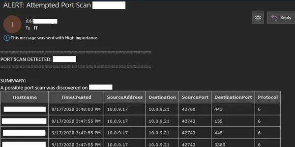

Welcome to The B.T.P.S Security Package's documentation!
========================================================
* `GitHub Page <https://github.com/OsbornePro/BTPS-SecPack>`_
* `GitLab Page <https://gitlab.com/tobor88/BTPS-SecPack>`_
* `PayPal Donations <https://www.paypal.com/cgi-bin/webscr?cmd=_donations&business=AGKU5LWZA67XC&currency_code=USD&source=url>`_
* `LiberPay Donations <https://liberapay.com/tobor/donate>`_
* `Report Issues <https://osbornepro.com/schedule-or-contact>`_

**General Summary for this project can be read at** https://github.com/tobor88/BTPS-SecPack/blob/master/README.md

The Installer.ps1 script is good to go. I created a virtual environment and ran everything from scratch to ensure you get the max protection and visibility possible with the least amount of fuss. If you experience any trouble please let me know so I am aware and can fix it. If you experience any issues or need help, feel free to reach out to me. My aim is to make this as easy to get going as possible. If something is to difficult or confusing please tell me about it. rosborne@osbornepro.com I am still adding content to this site as it is fairly new.

**FEATURES COMING SOON**

* **ELK SIEM Tool:** I am going to set up a configuration for the ELK SIEM tool. This tool is free for certain uses and offers a purchase if desired. It will include `Elasticsearch <https://www.elastic.co/elasticsearch/>`_, `Kibana <https://www.elastic.co/kibana>`_, and `Winlogbeat <https://www.elastic.co/beats/winlogbeat>`_. The configuration is going to use the Windows Event Forwarding (WEF) configuration. The purpose of this is to prevent the need to install agents on the devices in your environment. The free version does not offer LDAP authentication unfortunately. The configuration will use TLS certificates to encrypt communications on the local host and listen for outside connections if you decide to install other stack programs such as `APM-Server <https://www.elastic.co/apm>`_, `Heartbeat <https://www.elastic.co/beats/heartbeat>`_, or `Metricbeat <https://www.elastic.co/beats/metricbeat>`_. `Winlogbeat <https://www.elastic.co/beats/winlogbeat>`_ logs will be modified to include `GeoIP data <https://www.elastic.co/blog/geoip-in-the-elastic-stack>`_ tags that can be used for mapping IP addresses. Default passwords will of course also be changed. I will also create a Docker file that can be used to prevent the need for too much manual set up. When available it can be obtained from the Official OsbornePro LLC docker site: https://hub.docker.com/orgs/osbornepro
* I am **NO** longer planning on integrating the `Virus Total API <https://support.virustotal.com/hc/en-us/articles/115002100149-API>`_ for MD5 hash comparisons. This does not provide enough cost per value however I will include a script to do this in case it is valuable to your situation.

**IMPORTANT:** This **Blue Team PowerShell Security Package**, assumes that you have referenced the `Windows Event Logging Cheat Sheet <https://www.malwarearchaeology.com/cheat-sheets/>`_ for logging in your environment. Use `LOG-MD <https://www.imfsecurity.com/free>`_ or `CIS-CAT <https://www.cisecurity.org/cis-benchmarks/>`_ (an SCAP Tool) to ensure the recommended logging is configured. These logging recommendations adhere to commonly accepted guidelines in the cyber security community. Even without the use of this security application, these guidelines should be followed to better assist your organization in the event of a compromise.

**CODE CONTRIBUTIONS**
I am always open to suggestions and ideas as well as contributions if  anyone wishes to help add to this package. Credit will of course be given where credit is due. If you wish to contribute I have placed some info on that `HERE <https://github.com/tobor88/BTPS-SecPack/blob/master/CONTRIBUTING.md>`_.

**What Purpose Does This Serve?**
This repository contains a collection of PowerShell tools that can be utilized to protect and defend an environment based on the recommendations of multiple cyber security researchers at Microsoft. These tools were created with a small to medium size mostly Windows environment in mind as smaller organizations do not always have the type of funding available to overly spend on security. The goal of this project lines up with the goals of `OsbornePro LLC. <https://osbornepro.com/>`_ This exists to help add value to a smaller organization's security by creating more visibility for the IT Administrator or Security Team.

For the case of organizations with 1,000’s of devices; you may find that this entire suite does not apply to you. This has to do with how some of the discoveries operate. For example the alert I have in the `Device Discovery <https://github.com/tobor88/BTPS-SecPack/tree/master/Device%20Discovery>`_ directory relies on DHCP assigned IP addresses. All DHCP servers in an environment are queried to create a list of known MAC addresses. This information is then saved to a CSV file for reference in discovering any new devices that join a network. This file could become too large to be effective. The other alert I can see not being effective is the `"Local Port Scan Alert" <https://github.com/tobor88/BTPS-SecPack/blob/master/Local%20Port%20Scan%20Monitor/Watch-PortScan.ps1>`_. This is because if there is an over abundance of connections the script will not be able to cover all of the connections quickly enough. Other alerts in this security package are still appropriate no matter the network size as they are Event ID based typically. To begin, I suggest setting up WinRM over HTTPS in your environment.

Functionality in The Blue Team PowerShell Security Package
----------------------------------------------------------

**Account Lockout Notification**

.. image:: img/AccountLockout.png
   :scale: 100
   :alt: Account Lockout

**Attempted Port Scan**

.. image:: img/AttemptedPortScan.png
    :scale: 100
    :alt: Attempted Port Scan

**AutoRuns Logging**

.. image:: img/AutoRuns.png
    :scale: 100
    :alt: AutoRuns

**Blacklisted IP Logging**

.. image:: img/BlacklistedIP.png
    :scale: 100
    :alt: Blacklisted IP Logging

**Check Forwarding Rules**

**Track Network Connection History**

**Disable Weak SSL Ciphers**

**DNS Zone Transfer Alerts**

.. image:: img/DNSZoneTransfer.png
    :scale: 100
    :alt: DNS Zone Transfer Alerts

**Enable DNS over HTTPS**

**Insecure LDAP Bind Notifications**

**New Device Joined Network Discovery**

**User Changed Password Notification**

.. image:: img/NormalPasswordChange.png
    :scale: 100
    :alt: User Changed Password Notification

**Admin Changed Another Users Password Notification**

.. image:: img/PasswordChanged.png
    :scale: 100
    :alt: Admin changed another users password notification

**List of Expiring Passwords Notification**

**Local Port Scan Notification**

**Remediate a compromised Office365 account**

.. image:: img/RemediateCompromisedOfficeAccount.png
    :scale: 100
    :alt: Remediate a compromised Office365 account

**Suspicious Event Occurred**

.. image:: img/SuspiciousEventTriggered.png
    :scale: 100
    :alt: Suspicious Event Occurred

**Unusual Sign In Alert**

**User Account Expiring Notification**

**User Account Unlocked**

.. image:: img/UserAccountUnlocked.png
    :scale: 100
    :alt: User Account Unlocked

Using the Installer.ps1 File to Get Started
===========================================
I wrote the `Installer.ps1 <https://github.com/OsbornePro/BTPS-SecPack/blob/master/Installer.ps1>`_ script allow anyone to quickly and easily install as many protections as possible offered by the B.T.P.S. Security Package. Running this script requires very minimal to zero know how. You do not need to know how to download the Git repository. `Installer.ps1 <https://github.com/OsbornePro/BTPS-SecPack/blob/master/Installer.ps1>`_ will do it for you :-)

**How can I get started using the Installer.ps1 install file?**
Here is what you need to do in order to execute this file.

1. Log into your Primary Domain Controller using an account with Administrator permissions.
2. Open an Administrative PowerShell session (Windows Key + X, The press A).
3. Execute the command in step 4. This can be done by highlighting the command (starting from IEX all the way too /Installers.ps1. This command is all one line.). Right click the highlighted text and select "COPY". Then Right Click inside your PowerShell window. If this does not paste right away you can paste by doing the key combo (Ctrl + V). This command executes all the text on that webpage inside of your powershell session without downloading the file to your disk drive.
4. ``IEX (New-Object -TypeName System.Net.WebClient).downloadString('https://raw.githubusercontent.com/OsbornePro/BTPS-SecPack/master/Installer.ps1')``
5. The installation of the B.T.P.S Security Package should then start. Some Next Generation Anti-Virus providers may block script execution in this manner. If that is the case use the below method to accomplish the same task.

**IF ABOVE COMMAND METHOD DOES NOT WORK**
Some Next Generation Anti-Virus providers may block script execution in this manner. If that is the case use the below method to accomplish the same task.

1. Log into your Primary Domain Controller using an account with Administrator permissions.
2. Open an Administrative PowerShell session (Windows Key + X, The press A).
3. The command displayed in step 4 will download the script to your disk in your Downloads directory. Copy and paste the command into your admin powershell session and press ENTER to execute it.
4. ``Invoke-WebRequest -Uri "https://raw.githubusercontent.com/OsbornePro/BTPS-SecPack/master/Installer.ps1" -OutFile "$env:USERPROFILE\Downloads\Installer.ps1"``
5. Execute the command line in step 6 to ensure your Execution Policy allows the script to execute easily. Copy and paste the command into your admin powershell session and press ENTER to execute it.
6. ``Set-ExecutionPolicy RemoteSigned -Force``
7. Execute the command line in step 8 to run the script and being installation. Include the period at the beginning of the command. Copy and paste the command into your admin powershell session and press ENTER to execute it.
8. ``."$env:USERPROFILE\Downlods\Installer.ps1"``
9. The installation of the B.T.P.S. Security Package should then begin.

**OTHER DOWNLOAD FILE COMMANDS**
As an FYI there are multiple ways to download files from the PowerShell session. If ``Invoke-WebRequest`` is blocked or does not work for you try the below commands instead. Each command does the same thing in a different way and each command is one line.

* ``(New-Object Net.WebClient).DownloadFile('https://raw.githubusercontent.com/OsbornePro/BTPS-SecPack/master/Installer.ps1', "$env:USERPROFILE\Downloads\Installer.ps1")``
* ``Start-BitsTransfer "https://raw.githubusercontent.com/OsbornePro/BTPS-SecPack/master/Installer.ps1" -Destinations "$env:USERPROFILE\Downloads\Installer.ps1"``
* ``certutil.exe -urlcache -split -f https://raw.githubusercontent.com/OsbornePro/BTPS-SecPack/master/Installer.ps1 "$env:USERPROFILE\Downloads\Installer.ps1"``
* ``bitsadmin /transfer debjob /download /priority normal https://raw.githubusercontent.com/OsbornePro/BTPS-SecPack/master/Installer.ps1" "$env:USERPROFILE\Downloads\Installer.ps1"``

Download PDF Instructions for Installer.ps1
-------------------------------------------
Below link contains images and walks you through the Installer.ps1 setup steps and process.
https://github.com/OsbornePro/Documents/raw/main/Installer.ps1%20Demo.pdf

Configure WinRM over HTTPS
==========================
I posted a YouTube video covering the settings configured for WinRM over HTTPS communication through the use of Group Policy. These settings can be seen in the sections below.
`YouTube Video : Configure WinRM over HTTPS Instructions <https://youtu.be/UcU2Iu9AXpM>`_

Useful WinRM Info and Commands To Know
--------------------------------------
Setup WinRM over HTTPS may require the need to know a few commands. I have included these commands below.

``Enable-PSRemoting -Force # Enables firewall rules for WinRM``
``winrm qc -q # Qucik config for WinRM 5985``
``winrm enum winrm/config/listener # Enumerate cert thumbprint used on different winrm ports``
``winrm delete winrm/config/listener?Address=*+Transport=HTTPS # Delete winrm certificate and stop listener on 5986. This allows new cert to be attached to port``
``winrm create winrm/config/listener?Address=*+Transport=HTTPS # Creates a WinRM listener on 5986 using any available certificate``

The below command defines a certificate to use on port 5986. Certificate Template needed is a Web Server certificate from Windows PKI
``New-WSManInstance -ResourceUri WinRM/Config/Listener -SelectorSet @{Address = "*"; Transport = "HTTPS"} -ValueSet @{Hostname = FqdnRequiredHere.domain.com; CertificateThumbprint = $Thumbprint }``

**SERVER CERTIFICATE:**
The certificate thumbprint value that you are going to need in "Group Policy Setting 1" below is from your internal domains Private Key Infrastructure (PKI). This value will vary as these values are unique to the certificate. The Root Certificate Authority (CA) assigns certificates to your devices. When a device receives a certificate, it gets assigned under the Root CA's certificate. This creates what is called a Certificate Chain. If it helps to see this represented in a directory tree format, it would look something like the below tree structure. Your domain would not have an Intermediate CA most likely but I included it for the visual.

* Root CA Certificate <-- This is the certificate thumbprint you need
    * Intermediate CA Certificate
        * Assigned Device Certificate
        * Assigned Device Certificate <-- This certificate's thumbprint gets assigned to port 5986 on the client device.

**CLIENT CERTIFICATE:**
* In the above tree, "Assigned Device Certificate" is where the command
``New-WSManInstance -ResourceUri WinRM/Config/Listener -SelectorSet @{Address = "*"; Transport = "HTTPS"} -ValueSet @{Hostname = FqdnRequiredHere.domain.com; CertificateThumbprint = $Thumbprint }``
would come in.
* Notice the "Hostname" value includes the domain you are in. This needs to also be true for the "Common Name" value when the client device requests the WinRM certificate. This means your CN value is required to be devicename.domainname.com. If you do not include the domain name in the Common Name value your WinRM over HTTPS communication will not work. Subject Alternative Name's (SAN) will not work either. I have tried adding more than one Common Name values to a certificate and this communication still failed.
* If you are using a Windows Server Certificate Authority, the "WebServer" certificate template can be used to request the certificate needed.

Group Policy Windows Event Forwarding (WEF) Settings
----------------------------------------------------
**GROUP POLICY SETTING 1**

The Group Policy setting "Computer Configuration > Policies > Administrative Templates > Windows Components > Event Forwarding > Configure Target Subscription Manager" needs to be set to WinRM over HTTPS (Port 5986): In my environment I added 2 entries for this to cover all basis. One has the CA certificate thumbprint with with spaces after every 2 numbers, and the other entry is without spaces. The example values are below.

1. **Example Entry 1**
``Server=https://wef.domain.com:5986/wsman/SubscriptionManager/WEC,Refresh=900,IssuerCA=ff ff ff ff ff ff ff ff ff ff ff ff ff ff ff ff ff ff ff ff``

2. **Example Entry 2**
``Server=https://wef.domain.com:5986/wsman/SubscriptionManager/WEC,Refresh=900,IssuerCA=ffffffffffffffffffffffffffffffffffffffff``
**NOTE:** The default Refresh rate value is 900 seconds or 15 minutes. This does not need to be defined. I included it to be thorough.

3. **Example Entry 3**
Using the below value without a certificate defined will allow/use Kerberos for authentication which is fine to use
``Server=https://wef.domain.com:5986/wsman/SubscriptionManager/WEC,Refresh=900``

**GROUP POLICY SETTING 2**

The Group Policy Setting "Computer Configuration > Policies > Administrative Templates > Windows Components > Event Log Service > Security > Change Log Access" needs to be set to the value of the property "ChannelAccess" after issuing the below command:
``wevtutil gl security``

Group Policy Setting "Computer Configuration > Policies > Administrative Templates > Windows Components > Event Log Service > Security > Change Log Access (Legacy)" needs to be set to the value of the property "ChannelAccess" after issuing the below command:
``wevtutil gl security``

Group Policy WinRM Settings
---------------------------

**GROUP POLICY SETTING 3**

In your group policy settings go to "Computer Configuration > Preferences > Control Panel Settings > Services". Then right click and add a New Service. Set the "Startup Type" to "Automatic". Set the "Service Name" to WinRM, set the "Service Action" to "Start Service", set the "Wait Timeout" to 30 seconds. In the recovery tab select "Restart the Service" from the three failure options. Set "Reset Fail Count after" to 0 days and "Reset Service after" to 1 minutes. Then click OK to save.

**GROUP POLICY SETTING 4**

Next, still on the same policy object, is the list of IP addresses that are allowed to do remote management access  on the target computer. Go to Computer Configuration > Policies > Administrative Templates > Windows Components > Windows Remote Management (WinRM) > WinRM Services. Then double click on “Allow remote server management through WinRM” to modify the setting as follows:
Set the policy to "Enabled"
Set the IPv4 Filter to * or an all encompassing subnet for your environment such as ``10.0.0.0/16``
Leave the IPv6 Filter blank or set it to a wildcard * as well. Click OK to save.

**GROUP POLICY SETTING 5**

Edit the settings — Opening Firewall ports
Next we will create a new rule for the Firewall on the targeted client PC's. Go to Computer  Configurations > Policies > Security Settings > Windows  Firewall and Advanced Security > Windows Firewall and Advanced  Security then right click on Inbound Rules > New Rule

Create a new rule called Allow WinRM over HTTPS. We want to allow the inbound connection on port 5986. Leave the Tick mark on "Domain" and "Private". We then want to create a few more firewall rules using the default firewall rules "Remote Event Log Management (RPC-EPMAP)", "Remote Event Monitor (RPC-EPMAP)", "Remote Event Log Management (RPC)", "Remote Event Monitor (RPC)", "Remote Service Management (RPC-EPMAP)", "Remote Service Management (RPC)", "Remote Scheduled Tasks Management (RPC-EPMAP)", "Remote Scheduled Tasks Management (RPC)". This should be enabled to Allow inbound traffic in the "Domain", and "Private" profiles.  For good measure if you like you can deny traffic on port 5985. This is done by adding firewall default firewall rule "Windows Remote Management (HTTP-In)", and Blocking traffic to that port.

**GROUP POLICY SETTING 6**

Under Administrative Templates > Network > Network Connections > Windows Defender Firewall > Domain Profile set the policies for Windows Defender Firewall: Allow ICMP exceptions, Windows Defender Firewall: Allow inbound remote administration exception, and Windows Defender Firewall: Allow inbound Remote Desktop exceptions to "Enabled". Define the filter you used in Group Policy Setting 4 for these allowed values. For example you may have used a Wildcard * or defined an all encompassing subnet range such as ``10.0.0.0/16``

**GROUP POLICY SETTING 7**

Under Administrative Templates > System > Credentials Delegation > Allow delegating fresh credentials and set the values to ``WSMAN/*.yourdomain.com``. This will allow WinRM communication between any host ending in yourdomain.com. Then set "Allow delegating fresh credentials with NTLM-only server authentication" under that same tree to that value ``WSMAN/*.yourdomain.com``. For example my email rosborne@osbornepro.com is in the domain osbornepro.com. I would set the value to ``WSMAN/*.osbornepro.com``. We also want to Enable "Encryption Oracle Remediation" and set the drop down value to "Force Updated Clients". This is to prevent CVE-2018-0886 exploitation.

**GROUP POLICY SETTING 8**

Under Administrative Templates > Windows Components/Windows Remote Management (WinRM)/WinRM Client set the below settings.

Allow Basic authentication Enabled
Allow CredSSP authentication Enabled
Allow remote server management through WinRM Enabled
IPv4 filter: *
IPv6 filter: *
Allow unencrypted traffic Disabled
Disallow Kerberos authentication Disabled  # If you are have CCPD than enable this
Disallow WinRM from storing RunAs credentials Enabled

**GROUP POLICY SETTING 9**

Under Administrative Templates > Windows Components/Windows Remote Management (WinRM)/WinRM Service set the below settings

Allow Basic authentication Enabled
Allow CredSSP authentication Enabled
Allow remote server management through WinRM Enabled
IPv4 filter: *
IPv6 filter: *
Allow unencrypted traffic Disabled
Disallow Kerberos authentication Disabled
Disallow WinRM from storing RunAs credentials Enabled
Turn On Compatibility HTTP Listener Disabled
Turn On Compatibility HTTPS Listener Enabled

**GROUP POLICY SETTING 10**
Create a Registry Setting that gets pushed out through Group Policy containing the below value

**SETTING:**
``HKLM:\Software\Policies\Microsoft\Windows NT\CurrentVersion\NetworkList\Signatures\010103000F0000F0010000000F0000F0C967A3643C3AD745950DA7859209176EF5B87C875FA20DF21951640E807D7C24\Category``
``State``
``1``

**CONCLUSION**
WinRM over HTTPS is now configured for your environment. Great work! When you now use PowerShell commands such as ``Invoke-Command`` or ``New-PSSession`` you will need to specify the ``-UseSSL`` parameter in order to use WinRM over HTTPS. Port 5985 will not accept connections in an ideal setup.

Execute Scripts with Task Scheduler
===================================
External Link to a site that covers executing PowerShell scripts with Task Scheduler
https://www.windowscentral.com/how-create-automated-task-using-task-scheduler-windows-10

Solo Sysmon Setup
=================
In case you wish only to set up Sysmon in your environment; I have put together a PDF walkthrough on how to use my configuration. The below link contains images and a step by step walkthrough for deploying Sysmon in your domain environment.
https://github.com/OsbornePro/Documents/raw/main/Sysmon%20Setup-0001.pdf

Disclaimer
==========
**DISCLAIMER:** This suite nor any other security suite or tool can completely prevent or detect all security vulnerabilities. This tool adds monitoring to an environment and may not catch every possible scenario and is no guarantee of discovery.

.. toctree::
   :maxdepth: 2
   :caption: Contents:

Indices and tables
==================
* :ref:`genindex`
* :ref:`modindex`
* :ref:`search`
